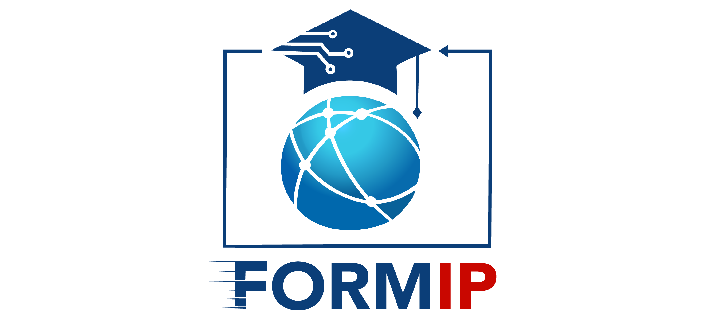

Bienvenue, architecte de l'automatisation ! 🛠️

Jusqu'à présent, vous avez appris les commandes individuellement. Il est temps de les assembler pour faire travailler le système **à votre place**. Un script n'est pas juste un fichier : c'est un robot personnel, une recette de cuisine pour votre ordinateur, votre premier pas vers la puissance de l'automatisation.

Dans ce lab, vous allez construire votre premier véritable arsenal de scripts :
1.  **Votre Premier Script** : L'art de donner des ordres à votre système.
2.  **La Mémoire du Script** : Utiliser des **variables** pour stocker des informations.
3.  **Les Scripts Polyvalents** : Accepter des **paramètres** pour rendre vos outils flexibles.
4.  **L'Intelligence du Script** : Prendre des **décisions** avec les conditions `if`.
5.  **La Puissance de la Répétition** : Exécuter des tâches en masse avec les **boucles** `for`.

À la fin de ce lab, vous ne serez plus un simple utilisateur de commandes, mais un créateur d'outils.

Prêt à construire vos premiers robots ? C'est parti ! 🚀